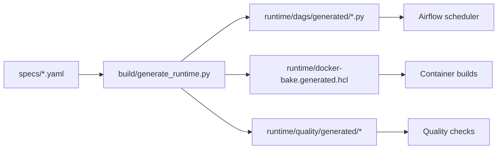
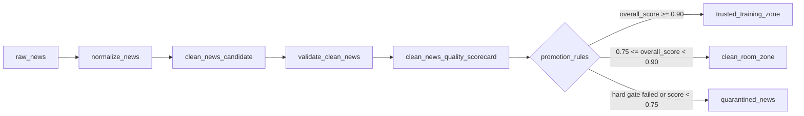
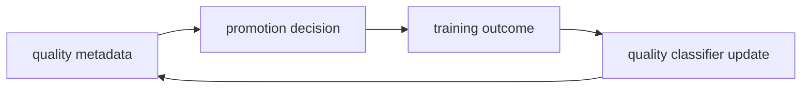

# Friendly Giggle

A lightweight control-plane definition for a continuous-learning market data system.

## Core idea

This repo separates intent from runtime artifacts.

The control plane describes:
- what data assets exist
- which sources produce them
- which DAGs transform them
- which quality gates protect the clean-room boundary
- which promotion rules move data from raw to clean room to trusted training
- which task containers eventually execute each unit of work

The runtime artifacts are generated from those specs.

```text
specs = portable system definition
generator = compiler
containers = execution units
Airflow/Kubernetes/Cloud Run = runtime
```



## Data zones

- raw_zone: everything lands here, including messy or malformed source data
- clean_room_zone: data that is normalized, timestamp-valid, deduplicated, and safe for analysis
- trusted_training_zone: clean-room data that passes stronger quality, leakage, label-maturity, and distribution checks

Training systems should only consume trusted-training assets.

## Control-plane structure

```text
specs/
  assets.yaml
  sources.yaml
  dags.yaml
  tasks.yaml
  quality_profiles.yaml
  promotion_rules.yaml
  hypothesis_registry.yaml
schemas/
  asset_manifest.schema.json
  quality_observation.schema.json
  hypothesis_event.schema.json
build/
  validate_specs.py
  generate_runtime.py
runtime/
  generated Airflow DAGs, Docker build files, quality suites, and runtime manifests
```

## Design principle

The spec should answer:
- What exists?
- What depends on what?
- What quality gates apply?
- What assets are produced?
- What should trigger downstream work?

The generated runtime should answer:
- Which container image runs?
- Which command is invoked?
- Which Airflow operator is used?
- Which resource limits apply?
- Which lineage metadata is emitted?

## Example flow

```text
raw_news
-> normalize_news
-> clean_news_candidate
-> validate_clean_news
-> clean_news_quality_scorecard
-> promote_or_quarantine
-> clean_room_news or quarantined_news
```



## Future direction

The first version uses deterministic quality gates.
Later, the system can learn a quality classifier using stored metadata:
- lineage
- timing
- validation results
- distribution statistics
- human review decisions
- downstream model outcomes

That creates a feedback loop:

```text
quality metadata -> promotion decision -> training outcome -> improved quality classifier
```


