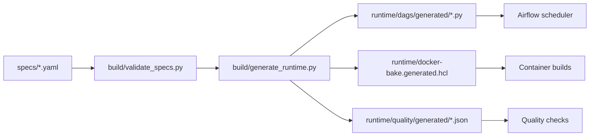
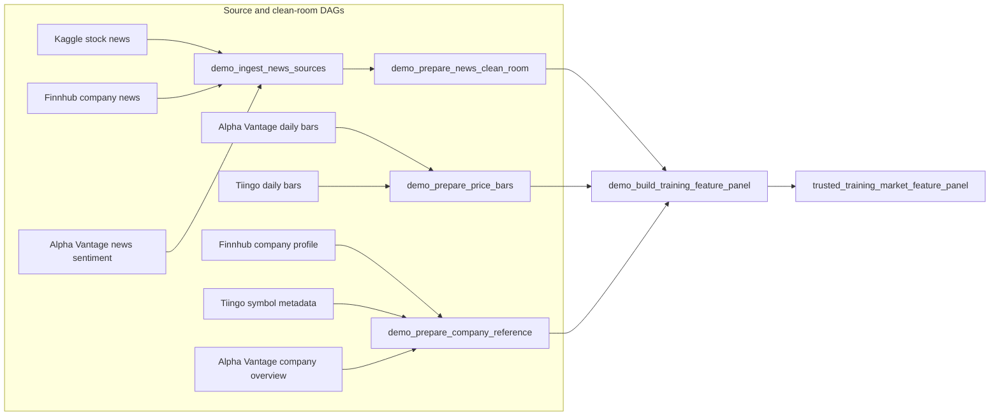
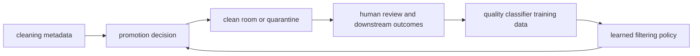
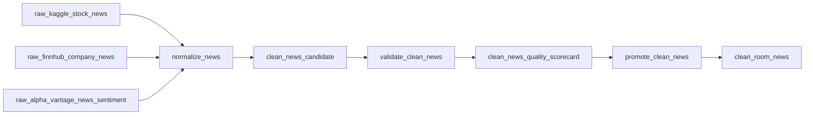
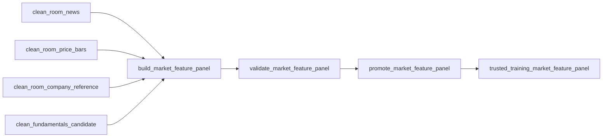
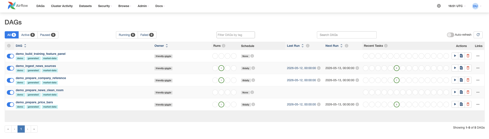

# Friendly Giggle

A lightweight control-plane definition for a continuous-learning market data system.


## Core Idea

This repo separates intent from runtime artifacts.

```text
specs = portable system definition
generator = compiler
containers = execution units
Airflow/Docker/Kubernetes = runtime
```


## Design Principle

Specs answer what exists, what depends on what, and what quality or promotion contract applies.

Generated runtime artifacts answer which Airflow DAGs, task commands, manifests, schema contracts, and container build targets implement that intent for a specific environment.

## Quick Start

Generate and validate runtime artifacts:

```sh
scripts/generate-runtime.sh
```

Validate generated DAG Python files:

```sh
scripts/validate-generated-dags.sh
```

Start local Airflow:

```sh
scripts/start-airflow-local.sh
```

Open `http://localhost:8080` and log in with `airflow` / `airflow`.

More detail:

- [Local Airflow demo](docs/local-airflow.md)
- [Source-shaped demo schemas](docs/source-schemas.md)
- [Spec vs containers](docs/spec-vs-containers.md)

## Control-Plane Structure

```text
specs/
  sources.yaml
  source_schemas.yaml
  assets.yaml
  dags.yaml
  tasks.yaml
  quality_profiles.yaml
  promotion_rules.yaml
build/
  validate_specs.py
  generate_runtime.py
schemas/
  asset_manifest.schema.json
  quality_observation.schema.json
runtime/
  airflow/docker-compose.yaml
  docker-bake.generated.hcl
  dags/generated/
    demo_ingest_news_sources.py
    demo_prepare_news_clean_room.py
    demo_prepare_price_bars.py
    demo_prepare_company_reference.py
    demo_build_training_feature_panel.py
  manifests/generated/
  quality/generated/
  stubs/Dockerfile
  stubs/run_task.py
scripts/
  generate-runtime.sh
  start-airflow-local.sh
  stop-airflow-local.sh
  clean-airflow-local.sh
  validate-generated-dags.sh
docs/
  local-airflow.md
  source-schemas.md
  spec-vs-containers.md
```



## Cleaning Metadata and Future Learning

Cleaning and filtering should emit metadata that explains both what happened to the data and why a promotion decision was made. The demo keeps this lightweight through asset manifests and quality scorecards, but the intended production contract should track:

- source metadata: provider, endpoint, request parameters, dataset snapshot, ingestion time, provider event time, raw payload hash, schema version, response status, latency, and retry count
- normalization metadata: input asset versions, transform code version, output schema version, null rates, type coercions, timestamp repairs, entity resolution confidence, provider conflicts, dedupe counts, dropped records, repaired records, and outlier flags
- quality metadata: hard gate results, soft score vector, overall score, freshness lag, distribution stats, leakage checks, join coverage, label maturity, warnings, blocking failures, promotion rule version, and final decision
- feedback metadata: quarantine reason, reviewer override, human review label, downstream model outcome, training run ID, and later incident or drift signals

The future learning loop is:



The first implementation should keep deterministic hard gates as the fail-closed boundary. Learned models can later assist soft scoring, quarantine triage, reviewer prioritization, and threshold tuning once enough feedback metadata exists.

## Data Zones

- `raw`: provider-shaped data exactly as landed
- `clean_candidate`: normalized data awaiting quality gates
- `metadata`: manifests, scorecards, lineage, and promotion decisions
- `clean_room`: analysis-safe assets
- `trusted_training`: assets that pass stronger leakage and training-readiness checks
- `quarantine`: assets or decisions blocked from downstream use

## Example Demo Flow





## Demo Scope


The repo now includes a runnable local demo that shows how market-data flows can be described as specs and compiled into Airflow DAGs. The first pass uses no-credential stub tasks for:

- Kaggle stock news dataset snapshots
- Finnhub open-data-style news and company reference flows
- Alpha Vantage daily bars, news sentiment, and company overview flows
- Tiingo daily bars and symbol metadata flows
- a cross-source training feature panel DAG


